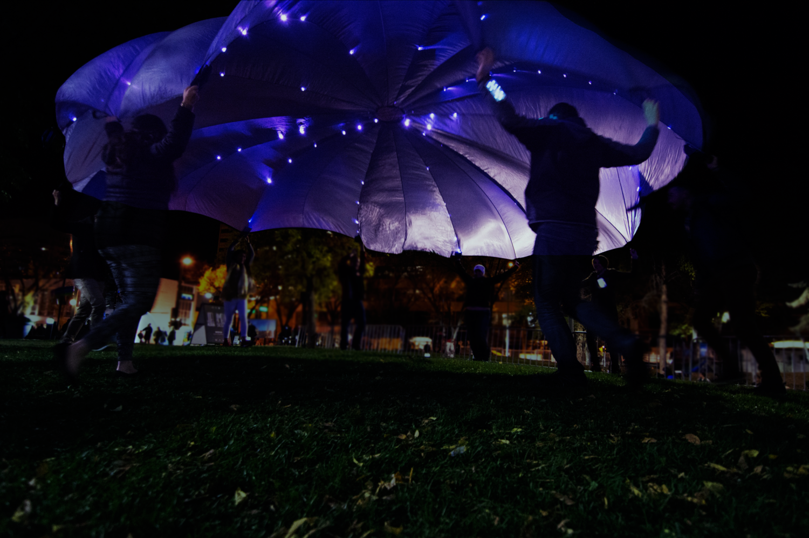

# Digital Parachute

Archival code from the 2017 Interactive Experience : _Nova_ : [Digital Parachute](https://www.ameliascott.ca/nova-digital-parachute)

*Created by Joel Adria & Amelia Scott* 

* 10x Indidividual Arduino devices controlling LED pixels in the parachute
* 1x Master "Handle" that is operable via bluetooth remote
* Controllable light patterns that accompany classic parachute games, including a special "starry night" effect when inside the parachute "mushroom"
* Accelerometer detects motion of the handles
* Custom made circuit prototype boards with acceleromters to detect "handle" motion. USB battery powered.
* Synchronization between handles using RS422 and [ICSC](https://github.com/MajenkoLibraries/ICSC) protocol for timing
* "Network" Wiring runs the circumfrence of the circle 
* Makes heavy use of FastLED in this version of the code
* This version does not implement any Bluetooth control
* Using high-flexibility CNC wire for reliability, each RGB pixel is individually soldered and hand sewn (courtesy the Banff Centre Summer Costuming Workstudies)
* Would definititely do this differently next time
